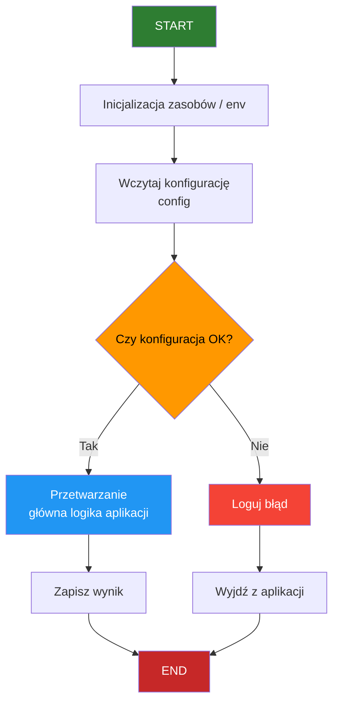

```mermaid
flowchart TD
    A[START] --> B[Inicjalizacja zasobów / env]
    B --> C[Wczytaj konfigurację<br/>config]
    C --> D{Czy konfiguracja OK?}
    
    D -->|Tak| E[Przetwarzanie<br/>główna logika aplikacji]
    D -->|Nie| F[Loguj błąd]
    
    E --> G[Zapisz wynik]
    G --> H[END]
    
    F --> I[Wyjdź z aplikacji]
    I --> H
    
    style A fill:#2E7D32,color:white
    style H fill:#C62828,color:white
    style D fill:#FF9800,color:black
    style E fill:#2196F3,color:white
    style F fill:#F44336,color:white
```
